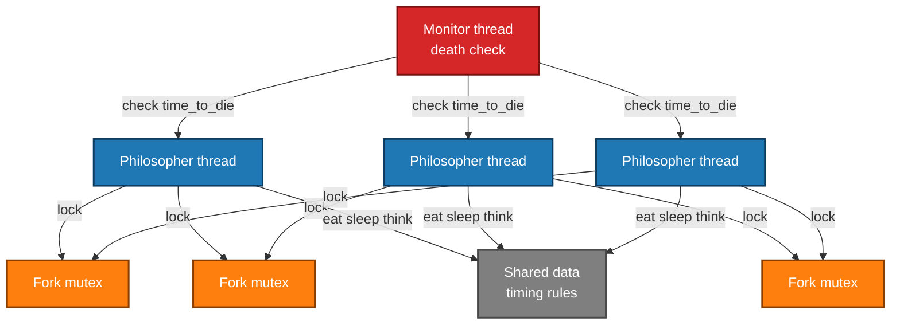

# Philosophers - Multithreading Simulation

  
📌 **42 School - Concurrency & Synchronization Project**  

## ▌ Description
The **Philosophers** project is a **multithreading simulation** based on the **Dining Philosophers Problem**.  
The goal is to manage multiple **philosophers** who must **eat, sleep, and think** while avoiding **starvation** and **deadlocks**.  
This project introduces **threads, mutexes, and semaphores** for process synchronization.
<!--  -->





## ▌ Key Features
▸ **Implements the Dining Philosophers Problem**  
▸ **Uses `pthread_create()`, `pthread_mutex_lock()`, and `pthread_mutex_unlock()`**  
▸ **Prevents deadlocks using mutexes or semaphores**  
▸ **Handles timing constraints and starvation prevention**  
▸ **Manages concurrent resource access efficiently**  

## ▌ Result: **100% Score**
The project was successfully validated with a **100% score**, meeting all evaluation criteria. 🎉

## ▌ Files
- `philo.h` → Contains function prototypes and required macros  
- `philo.c` → Main simulation loop and thread management  
- `Makefile` → Automates compilation (`all`, `clean`, `fclean`, `re`, `bonus`)  

## ▌ **Simulation Rules**
1. Philosophers sit at a round table with **one fork between each pair**.
2. Each philosopher can **eat, think, or sleep**.
3. To eat, a philosopher must **hold two forks** (one in each hand).
4. If a philosopher **does not eat within a given time**, they die.
5. The simulation stops **when a philosopher dies or when all have eaten a required number of times**.

### ■ **Input Arguments**
The program expects the following arguments:

number_of_philosophers time_to_die time_to_eat time_to_sleep [number_of_times_each_philosopher_must_eat]  

| Argument | Description |
|----------|-------------|
| `number_of_philosophers` | Number of philosophers (and forks) |
| `time_to_die` | Time (in ms) before a philosopher dies if they don’t eat |
| `time_to_eat` | Time (in ms) taken to eat |
| `time_to_sleep` | Time (in ms) taken to sleep |
| `number_of_times_each_philosopher_must_eat` _(optional)_ | If set, the simulation stops once all philosophers have eaten this many times |

### ■ **Simulation Logs**
Every philosopher’s state is printed in the format:  
`[timestamp_in_ms] [philosopher_id] [action]`  

Example logs:
```txt
100 1 has taken a fork 102 1 is eating 110 1 is sleeping 115 1 is thinking
```

## ▌ **Synchronization & Deadlock Prevention**
| Technique | Description |
|-----------|-------------|
| **Mutexes** | Used to protect fork access and avoid race conditions |
| **Semaphores (Bonus)** | Limits resource access efficiently |
| **Even/Odd Priority Handling** | Reduces contention over forks |

## ▌ **Bonus Features**
| Feature | Description |
|---------|-------------|
| ▸ **Philosophers as Processes** | Uses semaphores instead of mutexes |
| ▸ **Centralized Fork Management** | Uses a shared semaphore for all forks |
| ▸ **More Precise Timing** | Uses `gettimeofday()` for accurate timing |

## ▌ Compilation & Usage
### ■ **Compile the Program**
```sh
make
``` 

### ■ **Run Philosophers**
```sh
./philo 5 800 200 200
```

This starts **5 philosophers** with:  
- `800 ms` time to die  
- `200 ms` to eat  
- `200 ms` to sleep  

### ■ **Run with a Stop Condition**
```sh
./philo 5 800 200 200 5
```

The simulation will **end when each philosopher has eaten 5 times**.

## 📜 License

This project was completed as part of the **42 School** curriculum.  
It is intended for **academic purposes only** and follows the evaluation requirements set by 42.  

Unauthorized public sharing or direct copying for **grading purposes** is discouraged.  
If you wish to use or study this code, please ensure it complies with **your school's policies**.
